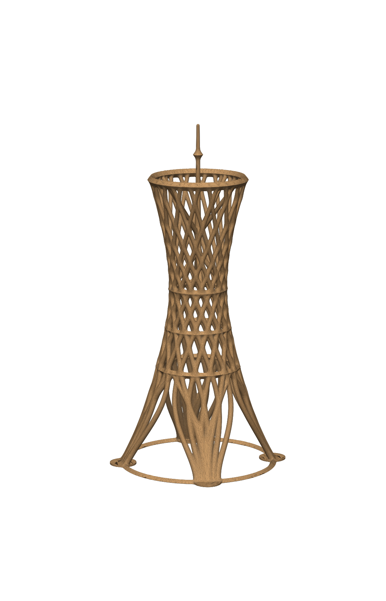

# Mae West × Eiffel – generative Fusionsskulptur (3D-druckbar)



Eine algorithmisch erzeugte Verschmelzung der **Mae West** (Rita McBride, Effnerplatz München, 2011)
mit dem **Eiffelturm** (Paris, 1889), von Anfang an für den FDM-Druck ohne Stützstrukturen ausgelegt.

| Datei | Inhalt |
|---|---|
| `out/mae_west_eiffel.3mf` | Druckdatei, 7,9 MB (empfohlen für Prusa/Bambu/Orca/Cura) |
| `out/mae_west_eiffel.stl` | dieselbe Geometrie als binäres STL, 33 MB |
| `out/mae_west_eiffel_report.json` | automatischer Druckbarkeits-Report |
| `out/*_overview.png` | Ansichten + Überhangkarte |
| `fusion.py` | Generator (SDF → Marching Cubes → mannigfaltigkeitserhaltende Vereinfachung) |
| `render.py` | Vorschau-Renderer |

## Design-DNA

| Element | Vorbild | Umsetzung |
|---|---|---|
| Rotationshyperboloid mit Taille | Mae West: H 52 m, Ø 32 m Fuß, Ø ≈ 7,5 m Taille, Ø 19,5 m Krone | Profil r(z) = Hyperbel oberhalb der Taille, Kronen-/Fußverhältnis 0,61 (= 19,5/32) |
| Zwei Stabscharen (±) | Mae-West-Rohrgitter | 2 × 16 Stäbe, Kinematik dφ/dz = C/r², das exakte Gesetz gerader Erzeugender eines Hyperboloids |
| 143° Verdrehung je Stab | aus den Mae-West-Maßen hergeleitet: atan(√(16²−3,75²)/3,75) + atan(√(9,75²−3,75²)/3,75) ≈ 143° | `twist_deg = 143` |
| 4 Beine auf quadratischer Basis, konkaves Profil | Eiffelturm | Stäbe unter z ≈ 54 mm zu 4 Beinen gebündelt, glatte Auffächerung (Wurzel-/Baumoptik); Eiffel-Potenzkurve blendet in die Hyperbel |
| Bögen zwischen den Beinen | Eiffelturm | Spitzbögen, deren Steigung numerisch so gelöst wird, dass kein Segment flacher als 50° ist |
| Plattformen, Spitze | Eiffelturm (57 / 115 / 276 m, Antenne bis 330 m) | Ringe mit Rauten-Querschnitt, Mast mit „Laterne“ über der Mae-West-Krone |
| Organik | generatives Design | exponentielle Smooth-Union (k = 0,35 mm) erzeugt knochenartige Verrundungen an allen Knoten; Stabdicke wächst lastgerecht von 2,0 mm (oben) auf 3,0 mm (unten) |

Proportionen sind bewusst **nicht** 1:1: Die Taille ist mit Ø 28 mm bei Ø 80 mm Fuß (0,35) breiter als bei Mae West (0,23), weil sich 32 Stäbe sonst zu einem Vollrohr verschmelzen würden. Die Taillenhöhe (62 % der Kronenhöhe) ist eine Designannahme, nicht gemessen.

## Druckbarkeit (automatisch geprüft)

| Kriterium | Wert |
|---|---|
| Wasserdicht / ein Körper | ja / 1 |
| Bauraum | 83,2 × 83,2 × 180,0 mm |
| Volumen | 27,4 cm³ ≈ 34 g PLA (bei 100 % Füllung, die Stäbe sind ohnehin voll) |
| Minimaler Stabwinkel zur Horizontalen | 50,0° (Bögen, Speichen), Gitterstäbe ≥ 55,6° |
| Flächenanteil Überhang > 45° | 0,28 % (lokale Sättel an Knotenunterseiten) |
| Flächenanteil Überhang > 60° | 0,10 % |
| Min. Stabdurchmesser | 2,0 mm (5 Extrusionsbreiten bei 0,4-mm-Düse) |
| Geometrieabweichung durch Vereinfachung | ≤ 0,02 mm |

### Empfohlene Slicer-Einstellungen (FDM, PLA)
- Aufrecht drucken, **keine Stützen**. Die 4 Fußpads + Basisring geben Haftung; Brim optional.
- Düse 0,4 mm, Schicht 0,12–0,16 mm für glatte Knoten (0,2 mm geht auch).
- Wände ≥ 3 (Stäbe werden damit massiv), Füllung egal.
- Oberhalb von ~150 mm (Mast/Spitze) ist die Schichtzeit sehr kurz: Mindest-Schichtzeit ≥ 8–10 s oder ein zweites Objekt mitdrucken, Lüfter 100 %.
- In der Slicer-Skalierung nicht unter **90 %** gehen (Stäbe < 1,8 mm), besser neu generieren.
- Harzdruck (SLA) funktioniert ebenfalls; dann innen nichts zu entleeren, da keine Hohlräume.

## Neu generieren / variieren

```bash
pip install -r requirements.txt
python3 fusion.py                       # ~1 min, schreibt out/mae_west_eiffel.{stl,3mf,_report.json}
python3 render.py out/mae_west_eiffel.stl out/mae_west_eiffel
python3 fusion.py --n-rods 20 --twist-deg 170 --out out/variante   # Beispielvariante
```

Alle Parameter (`--height`, `--r-base`, `--r-waist`, `--twist-deg`, `--n-rods`, `--leg-frac`, `--d-rod-top`, `--blend`, `--min-angle`, `--voxel`, …) siehe `Params` in `fusion.py`. Der Generator bricht ab, falls das Ergebnis kein einzelner wasserdichter Körper ist. Achtung: Maße sind absolute Millimeter, `--height` ändert nur die Höhe, nicht den Fußdurchmesser.

Quellen: [Mae West (Kunstwerk), Wikipedia](https://de.wikipedia.org/wiki/Mae_West_(Kunstwerk)), [Werner Sobek – Mae West](https://www.wernersobek.com/de/projekte/mae-west/), [NordOstKultur München](https://nordostkultur-muenchen.de/architektur/kunst-im-oeffentlichen-raum-im-muenchner-nordosten/skulptur-mae-west/), [Eiffel Tower, Wikipedia](https://en.wikipedia.org/wiki/Eiffel_Tower), [toureiffel.paris – 300 bis 330 m](https://www.toureiffel.paris/en/news/history-and-culture/300-330-meters-story-towers-height)
