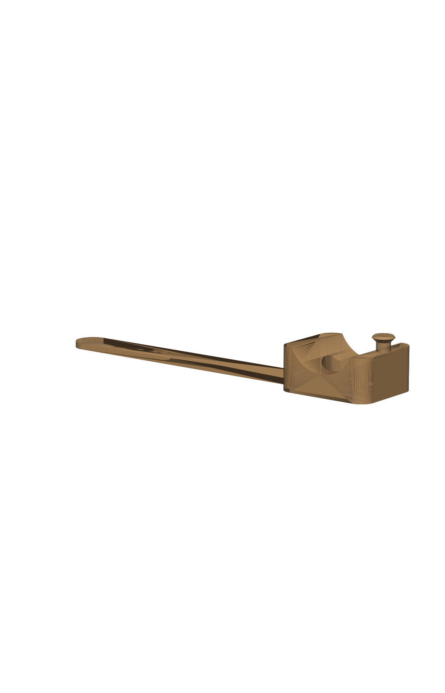

# Bajonett-Aufnahme für Decathlon-Fahrradklingel

Status: **Entwurf, axiale Maße der Klingel noch angenommen** (siehe „Offene Fragen“). Erst das Prüfstück drucken!



Ersatz für den originalen Hartplastik-Bajonettempfänger und das Silikon-Gliederband. Die Klingel wird eingesteckt, 90° gedreht und rastet über ihre zwei federnden Nocken ein.

## Funktionsprinzip

1. **Einstecken:** Schaft Ø 8,1 mm mit zwei Stiften (Spannweite 11,9 mm) passt durch ein Schlüsselloch in der 2,85-mm-Platte.
2. **Drehen um 90°:** Die Stifte laufen in einer Tasche hinter der Platte. Die Kontur dieser Tasche entspricht exakt der Fläche, die die Stifte beim Drehen von 0 bis 90° überstreichen. Sie ist damit zugleich der **Drehanschlag** in beiden Richtungen.
3. **Einrasten:** Die federnden Nocken (2,9 mm) fallen in zwei 0,8 mm tiefe Rastmulden. 0,2 mm Vorspannung bleiben, damit nichts klappert.
4. **Band:** Es läuft um den Lenker und wird über einen Pilzknopf gezogen. 4 Löcher im Abstand von 6 mm dienen zum Nachstellen.

Der Generator prüft das per **Funktionstest** mit einem virtuellen Klingel-Dummy:

| Test | Ergebnis |
|---|---|
| Kollision beim Einstecken | 0,000 mm³ |
| Kollision beim Drehen 0–90° (31 Schritte) | 0,000 mm³ |
| Überdrehen auf 100° blockiert | 2,08 mm³ Kollision, der Anschlag wirkt |
| Nocken-Vorspannung verriegelt | 2,61 mm³ (so gewollt) |
| Tragfläche der Stifte hinter der Platte | 10,8 mm² (beide Stifte zusammen) |

## Varianten (`out/`)

| Variante | Teile | Material | Bewertung |
|---|---|---|---|
| `tpu_monolithic/` | Aufnahme mit angeformtem Band, 113 × 24 × 17 mm, 8,8 g | TPU (95A) | 1 Druck, greift den Lenker gut. Das Bajonett ist aber weich: Die Rastung fühlt sich schwammiger an, bei einem harten Schlag kann die Klingel herausgehebelt werden, die Plattenkanten fließen maßlich eher. |
| `hybrid_petg_tpu/` | Aufnahme 31 × 24 × 17 mm (PETG) + Band 82 × 10 × 1,8 mm (TPU) | PETG + TPU | **Empfohlen.** Entspricht dem Originalkonzept (hart + elastisch), die Rastung ist präzise und klickt. Zwei Drucke, Materialwechsel nötig. |

Jede Variante enthält:
- `bell_bayonet_mount.{3mf,stl}`
- `bell_bayonet_fit_coupon.{3mf,stl}`, das Prüfstück (Ø 24 × 6,5 mm, nur Platte + Tasche + Rastmulden)
- `bell_bayonet_strap.*`, nur bei der Hybrid-Variante
- `bell_bayonet_assembly_preview.stl`, nur zur Ansicht mit der Klingel-Attrappe, **nicht drucken**
- `bell_bayonet_report.json`, der Prüfbericht

## Maße

| Parameter | Wert | Quelle |
|---|---|---|
| Schaft-Ø | 8,1 mm | gemessen („etwas über 8“) |
| Stiftbreite | 3,1 mm | gemessen („etwas über 3“) |
| Stiftspannweite inkl. Schaft | 11,9 mm | gemessen („knapp 12“) |
| Nockengröße | 2,9 mm | gemessen („knapp 3“) |
| Innenabstand der Nocken | 11,1 mm | gemessen, **Deutung als Innenmaß ist eine Annahme** (aus Foto 01 plausibel: Nockenmitten bei r ≈ 7 mm) |
| Lage der Nocken | 90° versetzt zu den Stiften | aus Fotos 01 und 04 |
| Auflagefläche der Klingel bis Unterkante Stifte | **3,0 mm** | ANGENOMMEN |
| Stiftdicke axial | **2,0 mm** | ANGENOMMEN |
| Überstand über den Stiften (Mittelnoppe) | **1,0 mm** | ANGENOMMEN |
| Nockenhöhe über der Auflagefläche | **1,0 mm** | ANGENOMMEN |
| Klingelboden-Ø | 35 mm | aus Foto 01 geschätzt (±2 mm) |
| Lenker-Ø | **22,2 mm** | ANGENOMMEN (Griffbereich-Standard) |

Passung: 0,25 mm radial (TPU) bzw. 0,20 mm (PETG), 0,15 mm axial.

Band-Vorspannung am Lenker Ø 22,2 (Pfadlänge monolithisch 60,2 mm, hybrid 45,9 mm):

| Loch | 1 | 2 (nominal) | 3 | 4 |
|---|---|---|---|---|
| Dehnung monolithisch | 17 % | 5 % | −5 % | −13 % |
| Dehnung hybrid | 22 % | 5 % | −8 % | −18 % |

Negative Werte bedeuten, dass das Loch für dickere Lenker gedacht ist (bei 25,4 mm kommen etwa +5 mm Umfangspfad hinzu). Diese Werte sind gerechnet, nicht erprobt.

## Druck

- **Lage:** Auflagefläche der Klingel auf dem Bett, so wie in der Datei. **Keine Stützen.** Einzige Brücken sind die Decken der Rastmulden (3,4 mm), die Knopfköpfe haben 45° Unterseite.
- **TPU (95A):**
  - Direktextruder empfohlen, 15–25 mm/s, Retraktion klein oder aus, Filament trocken.
  - 3 Wände, 40–60 % Gyroid-Füllung für die Aufnahme, das Band wird zu 100 % voll gedruckt.
- **PETG:** 0,2-mm-Schicht, 4 Wände, 40 % Füllung. PETG verträgt Sonne und Wärme besser als PLA, ASA wäre noch besser.
- **Reihenfolge:**
  1. Prüfstück drucken (wenige Minuten) und die Klingel testen: Geht sie rein, dreht sie, rastet sie ein?
  2. Erst dann die Aufnahme drucken.
  3. Klemmt es, `--fit` um 0,05 erhöhen. Wackelt die Klingel axial, `--clamp-gap` anpassen.

```bash
# monolithisch TPU
python3 projects/bike-bell-bayonet/generate.py --out projects/bike-bell-bayonet/out/tpu_monolithic
# hybrid PETG-Aufnahme + TPU-Band
python3 projects/bike-bell-bayonet/generate.py --strap separate --material PETG --fit 0.2 \
    --out projects/bike-bell-bayonet/out/hybrid_petg_tpu
# nach dem Nachmessen z.B.
python3 projects/bike-bell-bayonet/generate.py --clamp-gap 3.4 --lug-h 1.6 --nub-h 1.2 --bar-d 25.4
```

## Offene Fragen (zum Nachmessen)

1. **Auflage bis Stifte:** Abstand von der Fläche, mit der die Klingel auf der Aufnahme aufliegt, bis zur Unterkante der Stifte. Das ist die wichtigste Zahl, sie bestimmt die Plattendicke.
2. **Stiftdicke axial** und wie weit Schaft oder Mittelnoppe über die Stifte hinausragen.
3. **Nockenhöhe:** Wie weit stehen die Nocken im entspannten Zustand über die Auflagefläche? Ist die Auflagefläche eben, oder liegt der Schaft in einer Vertiefung?
4. **Lenker-Ø** an der Montagestelle: 22,2 mm, 25,4 mm oder 31,8 mm?
5. **Ausrichtung:** Wohin soll der Klingelhebel im eingerasteten Zustand zeigen, und in welche Richtung wird gedreht? Aktuell liegen die Stifte eingerastet parallel zum Lenker, gedreht wird gegen den Uhrzeigersinn, von der Klingel aus gesehen (`--lock-ccw`).
6. Bedeutet „11 mm Abstand“ bei den Nocken den Innenabstand oder den Mittenabstand?

Referenzfotos: `reference/01_top_ruler.jpg` bis `05_side_head.jpg`.

Generated by AI | Quellen: eigene Messungen des Nutzers (Fotos in `reference/`), Passungs- und TPU-Druckwerte sind übliche FDM-Richtwerte und keine Herstellerangabe.
