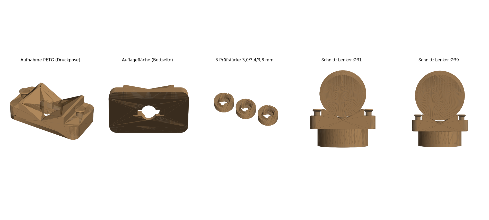

# Bajonett-Aufnahme für Decathlon-Fahrradklingel

Status: **Entwurf v2, Klemmmaß noch unsicher.** Zuerst die 3 Prüfstücke drucken, dann die Aufnahme.



Ersatz für den originalen Hartplastik-Bajonettempfänger und das Silikon-Gliederband. Die Klingel wird eingesteckt, 90° gedreht und rastet über ihre zwei federnden Nocken ein.

## Funktionsprinzip

1. **Einstecken:** Schaft Ø 8,1 mm mit zwei Stiften (Spannweite 11,9 mm) passt durch das Schlüsselloch der Platte.
2. **Drehen um 90°:** Die Stifte laufen in einer Tasche hinter der Platte. Die Kontur der Tasche entspricht exakt der Fläche, die die Stifte beim Drehen von 0 bis 90° überstreichen. Sie ist damit zugleich der **Drehanschlag** in beiden Richtungen.
3. **Einrasten:** Die Nocken (2,9 mm, stehen 1 mm vor) fallen in zwei 0,8 mm tiefe Rastmulden. 0,2 mm Vorspannung bleiben. Die Federzungen drücken die Stifte gegen die Plattenunterseite, so gleichen sie axiales Spiel aus.
4. **Lenker 31–39 mm inkl. Kabel:**
   - Die Aufnahme sitzt mit einer **V-Auflage** (120° Öffnung) auf dem Lenker, damit zentriert sie jeden Durchmesser im Bereich. Unter den Kabeln bleibt Luft.
   - Die Knöpfe sitzen auf tieferen Schultern außerhalb der Flanken. So kollidieren sie auch mit einem 39-mm-Lenker nicht.
5. **Band:** Es läuft um Lenker und Kabel und wird über einen Pilzknopf gezogen. Die Löcher sind so verteilt, dass jeder Durchmesser zwischen 31 und 39 mm ein Loch mit 3–12 % Vordehnung findet.

## Funktionstest (automatisch im Generator)

| Test | Ergebnis |
|---|---|
| Kollision beim Einstecken | 0,000 mm³ |
| Kollision beim Drehen 0–90° (31 Schritte) | 0,000 mm³ |
| Überdrehen auf 100° blockiert | 3,1 mm³ Kollision, der Anschlag wirkt |
| Nocken-Vorspannung verriegelt | 2,55 mm³ (so gewollt) |
| Tragfläche der Stifte hinter der Platte | 10,8 mm² |
| Lenker Ø 31 und Ø 39 gegen Aufnahme | 0,000 mm³ (liegt nur auf den Flanken) |
| Abstand Lenker zur Klingel-Mittelnoppe | 0,5 mm bei Ø 31, 1,1 mm bei Ø 39 |

## Varianten (`out/`)

| Variante | Teile | Maße | Masse |
|---|---|---|---|
| `hybrid_petg_tpu/` **(empfohlen)** | Aufnahme PETG, Band TPU (6 Löcher, Abstand 6,2 mm) | 44 × 24 × 13 mm, Band 132 × 12 × 1,8 mm | 11,7 g + 3,2 g |
| `tpu_monolithic/` | Aufnahme mit angeformtem Band (5 Löcher) | 168 × 24 × 13 mm, passt knapp auf das A1-mini-Bett (180 mm) | 14,2 g |

Die Hybrid-Variante entspricht dem Originalkonzept: harte Aufnahme für eine präzise Rastung, elastisches Band. Beim A1 mini: Aufnahme und Prüfstücke auf eine Platte in PETG, das Band auf eine zweite Platte in TPU.

Jede Variante enthält:
- `bell_bayonet_mount.{3mf,stl}`, die Aufnahme
- `bell_bayonet_fit_coupons.{3mf,stl}`, die 3 Prüfstücke
- `bell_bayonet_strap.*`, das Band (nur bei der Hybrid-Variante)
- `bell_bayonet_assembly_preview.stl`, nur zur Ansicht, **nicht drucken**
- `bell_bayonet_report.json`, der Prüfbericht

## Maße

| Parameter | Wert | Quelle |
|---|---|---|
| Schaft-Ø | 8,1 mm | gemessen |
| Stiftbreite / Spannweite | 3,1 / 11,9 mm | gemessen |
| Stiftdicke axial | 3,0 mm | Angabe „ca. 3 mm“, Foto 07 zeigt eher ≈ 2,5 mm. Mit 3,0 ist die Tasche eher zu groß, das ist unkritisch. |
| Nocken | 2,9 mm, Innenabstand 11,0 mm, 1 mm Überstand | gemessen und bestätigt |
| Auflage bis Unterkante Stifte (`clamp_gap`) | **3,4 mm (unsicher)** | siehe unten |
| Mittelnoppe über den Stiften | 1,2 mm | aus Gesamthöhe „etwas über 6 mm“ und Foto 06 |
| Lenker inkl. Kabel | 31–39 mm | gemessen |

**Widerspruch beim Klemmmaß:** Auflage bis Stifte „etwas weniger als 4 mm“ (≈ 3,8) plus Stiftdicke ≈ 3 mm ergibt 6,8 mm. Das ist mehr als die angegebene Gesamthöhe von „etwas über 6 mm“, obwohl die Mittelnoppe darin noch gar nicht enthalten ist. Foto 07 deutet eher auf ≈ 3,0 mm hin. Deshalb gibt es 3 Prüfstücke:

| Prüfstück | Kerben am Rand | `clamp_gap` | Plattendicke |
|---|---|---|---|
| 1 | 1 | 3,0 mm | 2,8 mm |
| 2 | 2 | 3,4 mm | 3,2 mm |
| 3 | 3 | 3,8 mm | 3,6 mm |

Richtig ist das dickste Prüfstück, bei dem sich die Klingel noch ganz eindrehen lässt und hörbar einrastet. Danach neu generieren:

```bash
python3 projects/bike-bell-bayonet/generate.py --strap separate --clamp-gap <Wert> \
    --out projects/bike-bell-bayonet/out/hybrid_petg_tpu
```

## Druck (Bambu Lab A1 mini)

- **Lage:** Auflagefläche auf dem Bett, so wie in der Datei. **Keine Stützen.** Einzige Brücken sind die Decken der Rastmulden (3,4 mm), die Knopfköpfe haben 45° Unterseite.
- **PETG (Aufnahme, Prüfstücke):** 0,16–0,2 mm Schicht, 4 Wände, 40 % Füllung, Passung 0,20 mm.
- **TPU (Band):** 95A, langsam (15–25 mm/s), Filament trocken, 100 % Füllung. Das Band ist nur 1,8 mm dick, es besteht also ohnehin fast nur aus Wänden.
- **Montage:**
  1. Band auf einen Knopf stecken.
  2. Um Lenker und Kabel führen.
  3. Das Loch wählen, bei dem das Band spürbar gespannt ist, und über den zweiten Knopf ziehen.
- **Klemmt es:** `--fit 0.25`. **Wackelt die Klingel:** höheres `--clamp-gap`-Prüfstück wählen.

## Offene Punkte

1. **Klemmmaß:** Welches Prüfstück passt?
2. **Ausrichtung:** Wohin soll der Klingelhebel im eingerasteten Zustand zeigen? Aktuell liegen die Stifte eingerastet parallel zum Lenker, gedreht wird gegen den Uhrzeigersinn von der Klingel aus gesehen. Umkehren mit `--lock-ccw false`.
3. **Verdrehen um den Lenker:** Die harte V-Auflage berührt den Lenker nur auf zwei Linien. Rutscht die Aufnahme um den Lenker, wäre eine dünne TPU-Zwischenlage die nächste Ausbaustufe (noch nicht umgesetzt).

Referenzfotos: `reference/01` bis `07`.

Generated by AI | Quellen: Messungen und Fotos des Nutzers (`reference/`). Passungs- und TPU-Druckwerte sind übliche FDM-Richtwerte und keine Herstellerangaben. [Bambu Lab A1 mini Tech Specs](https://bambulab.com/en/a1-mini/tech-specs) (Bauraum 180 × 180 × 180 mm, Direktextruder, TPU freigegeben).
