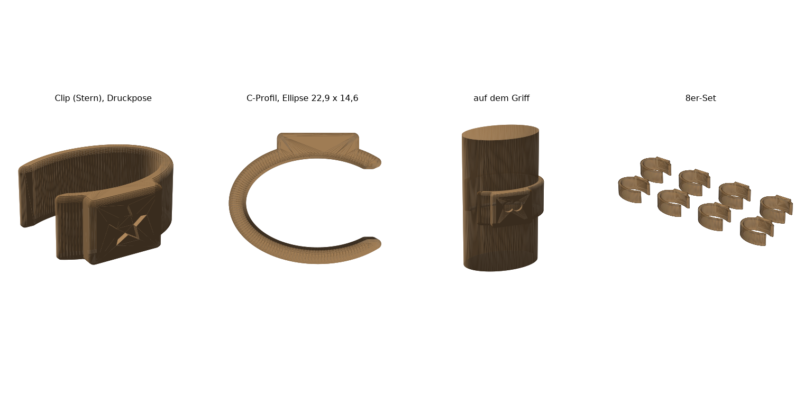
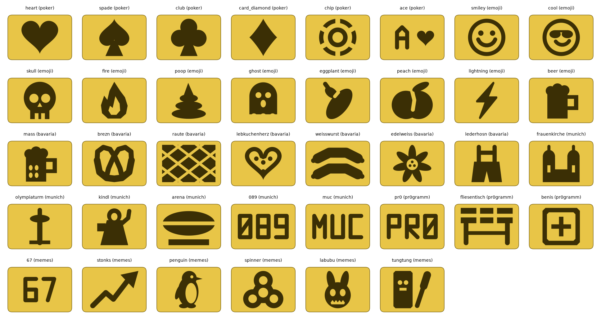
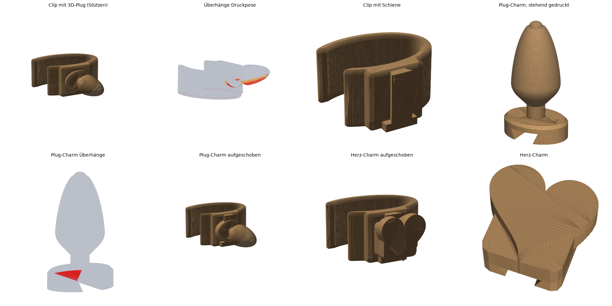

# Maßkrug-Markierclips

Status: **final v1.** Profilform mit der Schablone bestätigt (Kerbe 1 = Ellipse), Durchmesser auf Wunsch um 1 mm vergrößert. Der Clip selbst ist noch ungedruckt.



Kleine C-Clips, die seitlich auf den Henkel eines 1-l-Maßkrugs geklipst werden. Die Innenkontur folgt dem ovalen, abgerundeten Griffquerschnitt, so sitzt der Clip verdrehsicher. Unterschieden wird über die Filamentfarbe und zusätzlich über ein vertieftes Symbol auf einer kleinen Plakette. Das Symbol hilft bei Farbenblindheit, und eine Farbe reicht so für mehrere Personen. Vorbild waren die Referenzen in `reference/` (Stielring für Weingläser, Rand-Marker mit Symbolen).

## Maße

| Parameter | Wert | Quelle |
|---|---|---|
| Griffbreite quer zur Henkelebene | 22,9 mm | Messschieber 21,9 mm (Foto 03) + 1 mm, weil die Schablone knapp saß (Foto 05) |
| Griffstärke in der Henkelebene | 14,6 mm | Messschieber 13,6 mm (Foto 04) + 1 mm |
| Querschnittsform | Ellipse (n = 2,0) | mit der Profilschablone geprüft, Kerbe 1 passt |
| Profil entlang des Griffs konstant | ja | **ANGENOMMEN**, gemessen wurde am oberen Henkelbogen |

## Konstruktion

- **Clip:**
  - Die Innenkontur ist 0,4 mm kleiner als das Nennprofil 22,9 × 14,6 mm, also etwa 0,1 mm größer als die Schablone, die knapp gepasst hat. Die Vorspannung hält den Clip auf dem glatten Glas.
  - Wand 2,0 mm, Länge 10 mm entlang des Griffs.
  - Die Öffnung sitzt an einer Seitenkante des Griffs. Aufgeschoben wird seitlich, dabei muss die Öffnung nur auf die Griffstärke von 13,6 mm aufgehen, nicht auf die Breite von 21,9 mm.
  - Öffnung 10,5 mm, 2,0 mm Hinterschnitt je Seite, Umschlingung 260°. Die abgerundeten Lippen wirken als Einführschräge.
- **Druck:** Das C-Profil liegt flach auf dem Bett. Die Biegung beim Aufklipsen verläuft damit entlang der Druckbahnen, also in der starken Richtung, nicht quer über die Schichtgrenzen. Unten 0,4-mm-Fase im 45°-Winkel, oben verrundet. Keine Stützen.
- **Symbole:** 8 Varianten: `plain`, `circle`, `square`, `triangle`, `diamond`, `cross`, `star`, `heart`. Sie sind 0,8 mm tief in die Plakette versenkt, die 1,4 mm über der Wand steht. Die Wand selbst wird nicht geschwächt.

## Funktionstest (automatisch)

| Prüfung | Ergebnis |
|---|---|
| Umschlingung des Griffs | 260,5° |
| Hinterschnitt je Seite | 2,0 mm |
| Nötige Aufweitung beim Aufklipsen | 4,1 mm |
| Dehnung beim Aufklipsen | ≈ 0,9 % (Näherung für einen geschlitzten Ring). Die Streckgrenze liegt bei PETG bei grob 2,5 %, bei PLA bei grob 2 %, gedruckt eher darunter. |
| Vorspannungsfläche | 17,8 mm² |

Die Dehnung ist nur eine Balken-Näherung, keine FEM. Die Plakette versteift einen Arm, das ist nicht berücksichtigt.

## Icon-Bibliothek (`out/icons/`)



39 Einzelmodelle als 3MF, Dateiname `masskrug_<kategorie>_<name>.3mf`. Übersicht: `out/icons/icons_sheet.png`, Prüfwerte: `out/icons/icons_report.json`.

| Kategorie | Icons |
|---|---|
| Poker | `heart`, `spade`, `club`, `card_diamond`, `chip`, `ace` |
| Emoji | `smiley`, `cool`, `skull`, `fire`, `poop`, `ghost`, `eggplant`, `peach`, `lightning`, `beer` |
| Bayern | `mass` (Krug mit Noppen), `brezn`, `raute`, `lebkuchenherz`, `weisswurst`, `edelweiss`, `lederhosn` |
| München | `frauenkirche`, `olympiaturm`, `kindl` (stilisiert), `arena` (Stadion-Silhouette), `089`, `muc` |
| pr0gramm | `pr0` (Schriftzug, nicht das Logo), `fliesentisch`, `benis` (Plus im Kasten) |
| Memes | `67`, `stonks`, `penguin` (Nihilistic Penguin, 2026), `spinner` („2026 is the new 2016“), `labubu`, `tungtung` |
| Witz | `plug_3d`: echter 3D-Plug direkt am Clip, **braucht Stützen** (siehe unten, Alternative: Plug-Charm ohne Stützen) |

- **Technik:**
  - Motive sind 0,8 mm tief in die Plakette versenkt. Die Fläche dafür ist 10 × 7 mm groß.
  - Jedes Motiv wird automatisch geprüft: Es muss auf die Plakette passen, vertiefte Linien müssen ≥ 0,7 mm breit sein, erhabene Stege ≥ 0,6 mm.
  - Kürzel wie `089` sind mit einer eigenen Strichschrift gesetzt, die in `icons.py` definiert ist. Auf die Plakette passen höchstens 3 bis 4 Zeichen, deshalb gibt es kein „1158“ und kein „PROST“.
- **Druck:**
  - Die Plakette steht beim Druck senkrecht. Waagerecht löst die Düse etwa 0,4 mm auf, senkrecht eine Schichthöhe. Mit einer 0,2-mm-Schicht werden feine Motive sauberer.
  - Der Blitz und die Antenne des Olympiaturms haben spitze Enden, die etwas verrunden.
- **`plug_3d`:**
  - Echter Plug mit ovalem Fuß (10 × 7 mm), Hals Ø 2,6 mm und Kolben Ø 6,8 mm. Er ragt 16 mm waagerecht aus der Plakette.
  - Im Slicer „Stützen: Baum, nur auf Druckbett“ einstellen. Der Clip bleibt in seiner normalen Drucklage.
- **Bewusst nicht enthalten:**
  - Echte Vereins- und Markenlogos (FC Bayern, TSV 1860, BMW, Brauereien) und das pr0gramm-Logo. Sie sind markenrechtlich geschützt und landen hier in einem Repo.
  - Für den privaten Gebrauch lässt sich eine Hommage einfach in `icons.py` ergänzen.
- **Neu erzeugen:**

```bash
python3 projects/masskrug-marker/generate.py --symbol icons          # alle 39 nach out/icons/
python3 projects/masskrug-marker/generate.py --symbol heart --out /tmp/x   # einzelnes Icon inkl. STL
python3 projects/masskrug-marker/icon_sheet.py                       # Übersichtsbild
```

## Charm-System (`out/charms/`)



Ein Clip mit Schwalbenschwanz-Schiene, auf die sich beliebige Charms schieben lassen.

- **Schiene:**
  - Der Clip ist 12 mm lang, 2 mm länger als die Symbol-Clips.
  - Die Schiene läuft entlang des Griffs. Sie ist am Fuß 3,0 mm breit, oben 4,6 mm und 1,6 mm hoch.
  - Am bettseitigen Ende sitzt ein Anschlag, am anderen Ende eine 0,35 mm hohe Rastrampe.
  - Beim Druck ist alles senkrecht extrudiert, es gibt keinen Überhang.
- **Charm-Fuß:**
  - 8,3 mm lang in Schieberichtung, mit einer Nut an der Unterseite, 0,2 mm Spiel je Seite.
  - Er wird mit der Unterseite auf dem Bett gedruckt. Die Nutflanken stehen 63° steil, die Nutdecke ist eine 5-mm-Brücke.
- **Funktionstest (automatisch):**

| Prüfung | Ergebnis |
|---|---|
| Sitz in Endlage | 0 mm³ Kollision |
| Abziehen um 0,4 mm | 1,5 mm³ Kollision, der Schwalbenschwanz hält |
| 0,3 mm über den Anschlag hinaus | 1,4 mm³ Kollision, der Anschlag hält |
| Seitlich 0,4 mm | 4,1 mm³ Kollision, kein Wackeln über das Spiel hinaus |
| Rastrampe beim Aufschieben | max. 0,19 mm³ Überdeckung, das ist die Rastkraft. Ob sie in PETG reicht, zeigt erst der Druck. |

| Datei | Inhalt | Druck |
|---|---|---|
| `masskrug_clip_rail.3mf` | Clip mit Schiene | wie alle Clips, ohne Stützen |
| `masskrug_charm_plug.3mf` / `.stl` | Plug-Charm, 11 × 8,3 × 19 mm, Kolben Ø 8 mm | **stehend, ohne Stützen**: Kolbenunterseite 46,5° zur Waagerechten (Steigung 0,95), Hals Ø 3 mm |
| `masskrug_charm_heart.3mf` | Herz-Charm, 12 mm breit | stehend. Das Herz wächst im 45°-Winkel aus dem Fuß, erst ab 2,1 mm Höhe, damit nichts am Anschlag anstößt. |
| `masskrug_charm_blank.3mf` | leerer Fuß mit flacher Oberseite | zum Aufkleben eigener Minis |
| `masskrug_charm_fit_set.3mf` | 3 leere Füße mit 0,15 / 0,2 / 0,3 mm Spiel (1 / 2 / 3 Punkte) | zuerst drucken |

**Eigene Minifiguren:** Jedes wasserdichte STL oder 3MF, zum Beispiel von MakerWorld, wird automatisch skaliert (max. 14 × 14 × 22 mm), mittig auf einen Fuß gesetzt und verschmolzen:

```bash
python3 projects/masskrug-marker/generate.py --symbol charms --charm-stl pfad/zur/figur.stl
# -> out/charms/masskrug_charm_custom.3mf
```

Überhänge der fremden Figur werden dabei nicht geprüft. Die Figur selbst kann also Stützen brauchen.

## Dateien (`out/`)

| Datei | Inhalt | Masse |
|---|---|---|
| `masskrug_profile_gauge.*` | Profilschablone: 3 halbe Griffprofile (n = 2,0 / 2,5 / 3,0, markiert mit 1 / 2 / 3 Punkten), 69 × 19 × 2 mm | 2,3 g |
| `masskrug_fit_set.*` | 3 Clips ohne Symbol mit Vorspannung 0,2 / 0,4 / 0,6 mm (1 / 2 / 3 Punkte), 0,4 ist der Standard | 4,5 g |
| `masskrug_clip_<symbol>.*` | Einzelclip, 22,3 × 19,2 × 10 mm | 1,5 g |
| `masskrug_clip_set.*` | alle 8 Symbole auf einer Platte (8 Körper) | 12 g |
| `masskrug_report.json` | Prüfbericht | |

## Vorgehen

1. `masskrug_clip_set.3mf` drucken, eine Farbe pro Clip. Oder die Einzeldateien nacheinander.
2. Sitzt der Clip zu locker oder zu stramm: Clip 1 oder 3 aus dem Passungsset testen und mit dem passenden Wert neu erzeugen:

```bash
python3 projects/masskrug-marker/generate.py --symbol all --grip <0.2|0.6>
```

## Druck (Bambu Lab A1 mini)

- **PETG empfohlen:** Beim Spülen mit Clip wird PLA zu warm, es erweicht ab etwa 55–60 °C. PETG hält bis etwa 80 °C.
- 0,16–0,2 mm Schicht, 5 Wände, dann ist die Wand massiv.
- Mehrfarbig: In Bambu Studio jedem Clip des Sets einen eigenen Filament-Slot zuweisen, falls ein AMS lite vorhanden ist. Sonst die Einzeldateien nacheinander in verschiedenen Farben drucken.
- Der Clip berührt nur den Henkel, nicht den Trinkrand. Für PETG wird trotzdem keine Lebensmitteltauglichkeit zugesichert.

## Offene Punkte

1. Rückmeldung zum ersten echten Clip: Sitz, Rutschen, Aufklipskraft.
2. Initialen statt Symbolen bräuchten eine Schrift-Pipeline (noch nicht vorhanden).

Generated by AI | Quellen: Messungen und Fotos des Nutzers (`reference/01–05`), Designreferenzen aus MakerWorld-Screenshots des Nutzers (`reference/ref_*.png`). Meme-Recherche September 2026: [NapoleonCat](https://napoleoncat.com/blog/trending-memes/), [Wikipedia: Nihilistic penguin](https://en.wikipedia.org/wiki/Nihilistic_penguin), [Wikipedia: 2026 is the new 2016](https://en.wikipedia.org/wiki/2026_is_the_new_2016). Streckgrenzen und Glasübergangstemperaturen sind grobe Richtwerte für ungefüllte Filamente, keine Herstellerangaben.
